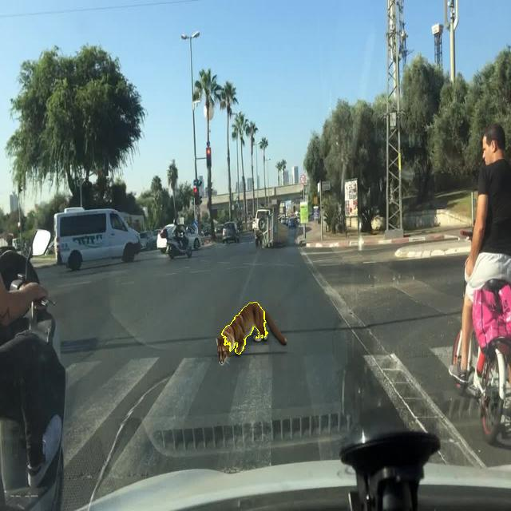

-----

# Road Anomalies Image Classification and Explainable AI Toolkit

This project provides a  toolkit for classifying weird traffic images using a pre-trained ResNet18 model and various Explainable AI (XAI) techniques to interpret model predictions. It includes functionalities for training classification models, classifying images, generating Grad-CAM++, LIME, and Occlusion Sensitivity explanations, and utilities for understanding data augmentations and testing image segmentation parameters.

-----

## Features

  * **Model Training**: Train a ResNet18-based image classification model from scratch or fine-tune it on your custom dataset with robust data augmentation, early stopping, and learning rate scheduling.
  * **Image Classification**: Classify images into predefined categories (e.g., "Normal" and "Anomalies") and optionally sort them into output directories based on their predicted class.
  * **Grad-CAM++ Visualization**: Generate Grad-CAM++ heatmaps to highlight the most important regions in an image that influenced the model's decision. Supports interactive display or saving heatmaps.
  * **LIME Explanation**: Provide local interpretable model-agnostic explanations (LIME) by perturbing input images and observing changes in predictions, marking boundaries of important superpixels. Supports interactive display or saving explanations.
  * **Occlusion Sensitivity**: Visualize model sensitivity to occluded regions, indicating which parts of an image contribute most to the model's confidence in a particular class. Supports heatmap or occlusion box visualizations, with interactive display or saving options.
  * **Supervised Occlusion Sensitivity**: A specialized occlusion sensitivity method that focuses on pre-defined regions (bounding boxes from YOLO-format labels) to measure their impact on model predictions. Useful for assessing the importance of known objects.
  * **Visualize Transformations**: A utility to visually inspect the effects of different image augmentation transformations, either individually or in combination, helping in understanding the data pipeline for training.
  * **Segmentation Parameter Tester**: A utility script to experiment with different image segmentation algorithms (Quickshift, Felzenszwalb, SLIC) and their parameters, which can be useful for fine-tuning LIME explanations.

-----

## Project Structure

```
.
├── datasets/                     # Directory for  training dataset (e.g., 'iteration_4' with class subfolders).
│   └── iteration_4/
│       ├── Class0_Normal/
│       └── Class1_Anomalies/
├── input_images/                 # Directory to place input images for classification and explanation.
│   └── labels/                   # (Optional) Directory for YOLO-format label files for supervised occlusion sensitivity.
├── output_images/                # Directory for classified images and XAI outputs.
│   ├── gradcam/                  # Grad-CAM++ output images.
│   ├── lime/                     # LIME explanation output images.
│   └── occlusion/                # Occlusion sensitivity output images.
├── Runs/                         # Directory where trained models (e.g., 'best_model_run_name.pth') will be saved.
├── best_model.pth                # Pre-trained PyTorch model weights (ResNet18) - typically moved here after training.
├── classification.py             # Script for image classification and sorting.
├── gradcam.py                    # Script for generating Grad-CAM++ visualizations.
├── lime_explanation.py           # Script for generating LIME explanations.
├── occlusion_sensitivity.py      # Script for generating occlusion sensitivity maps.
├── requirements.txt              # Lists all Python dependencies.
├── segmentation_test.py          # Utility for testing image segmentation parameters.
├── supervised_occlusion_sensitivity.py # Script for supervised occlusion sensitivity.
├── train.py                      # Script for training the image classification model.
└── visualize_transforms.py       # Utility for visualizing data augmentation transforms.
```

-----

## Dataset Link (Hugging Face)

```
https://huggingface.co/datasets/Vaquita-AI/Traffic-Anomalies/tree/main
```
-----

-----

## Setup and Installation

### Prerequisites

  * Python 3.x
  * NVIDIA GPU (recommended for faster processing, though CPU is supported)

### Installation Steps

1.  **Clone the repository**:

    ```bash
    git clone https://git-lehre.thi.de/faculty-i/huber/hci-and-xai/2025/team-9.git
    cd team-9
    ```

2.  **Create a virtual environment** (optional but recommended):

    ```bash
    python -m venv venv
    # On Windows
    .\venv\Scripts\activate
    # On macOS/Linux
    source venv/bin/activate
    ```

3.  **Install dependencies**:
    All necessary Python packages are listed in `requirements.txt`.

    ```bash
    pip install -r requirements.txt
    ```

4.  **Dataset Preparation for Training**:
    For training, organize your images into subfolders within a main dataset directory (e.g., `datasets/iteration_4/Class0_Normal`, `datasets/iteration_4/Class1_Anomalies`). The `train.py` script expects this structure.

5.  **Model Weights**:
    After training with `train.py`, a `best_model_<run_name>.pth` file will be saved in the `Runs` directory. For using the classification and XAI scripts, you'll typically copy the desired trained model (or rename it) to `best_model.pth` in the project's root directory, as other scripts expect this specific filename by default.

6.  **Input Images for Inference/XAI**:
    Place the images you wish to classify or explain into the `input_images/` directory.
    For `supervised_occlusion_sensitivity.py`, if you have YOLO-format bounding box labels, place them in `input_images/labels/` with corresponding filenames (e.g., `image.jpg` has `image.txt`).

-----

## Usage

### 1\. Model Training (`train.py`)

This script handles the training of your image classification model. It performs data loading, augmentation, training, validation, and early stopping.

```bash
python train.py
```

Upon execution, you'll be prompted to enter a **run name**. This name will be used to save your trained model (e.g., `best_model_<run_name>.pth`) in the `Runs` directory.

**Configuration Options within `train.py`**:

  * `dataset_path`: Point this to your main dataset directory (e.g., `"datasets\\iteration_4"`).
  * `num_epochs`: Set the maximum number of training epochs.
  * `patience`: Configure the early stopping patience.
  * `num_classes`: Define the number of classes in your dataset.
  * `batch_size`: Adjust the batch size for training and validation.
  * `num_workers`: Set the number of subprocesses to use for data loading.
  * Data augmentations (e.g., `transforms.RandomHorizontalFlip`, `transforms.RandomRotation`): Customize these to suit your dataset.

### 2\. Image Classification (`classification.py`)

The `classification.py` script classifies images from `input_images/` and can optionally copy them to an `output_images` subdirectory based on their predicted class.

```bash
python classification.py
```

Upon execution, you'll be prompted if you want to copy the images to the output directory.
Example: class 1 image: 


### 3\. Grad-CAM++ Visualization (`gradcam.py`)

The `gradcam.py` script generates Grad-CAM++ heatmaps to show where the model "looks."

You can configure the `mode` at the beginning of the `gradcam.py` script:

  * `mode = 'display'`: Interactively display heatmaps. Use `←` (left arrow) and `→` (right arrow) to navigate images, `ESC` to close the display.
  * `mode = 'save'`: Save heatmaps to `output_images/gradcam/`.

<!-- end list -->

```python
# In gradcam.py
mode = 'display' # Change to 'save' to save images
```

Then run the script:

```bash
python gradcam.py
```
Example: GradCAM++ Heatmap of class 1: 


### 4\. LIME Explanation (`lime_explanation.py`)

The `lime_explanation.py` script provides local interpretable model-agnostic explanations (LIME) for model predictions.

You can configure the `OPERATION_MODE` at the beginning of the `lime_explanation.py` script:

  * `OPERATION_MODE = 'display'`: Interactively display LIME explanations. Use `←` (left arrow) and `→` (right arrow) to navigate images, `ESC` to close the display.
  * `OPERATION_MODE = 'save'`: Save LIME explanations to `output_images/lime/`.

<!-- end list -->

```python
# In lime_explanation.py
OPERATION_MODE = 'display' # Change to 'save' to save images
```

Then run the script:

```bash
python lime_explanation.py
```
Example: LIME explanation of class 1:


### 5\. Occlusion Sensitivity (`occlusion_sensitivity.py`)

The `occlusion_sensitivity.py` script visualizes model sensitivity by occluding sliding windows across the image.

You can configure `visualization_type`, `mode`, and `save_what` at the beginning of the `occlusion_sensitivity.py` script:

  * `visualization_type`:
      * `'gaussian_blur'`: Visualizes sensitivity as a smoothed heatmap.
      * `'occlusion_boxes'`: Visualizes sensitivity using discrete occlusion boxes (still presented as a heatmap overlay).
  * `mode`:
      * `'display'`: Interactively display the visualizations.
      * `'save'`: Save the visualizations to `output_images/occlusion/`.
  * `save_what` (only for `visualization_type='gaussian_blur'` and `mode='save'`):
      * `'figure'`: Saves the entire matplotlib figure (original + heatmap side-by-side).
      * `'heatmap_overlay'`: Saves only the original image with the heatmap overlaid.

Example configuration for saving heatmap overlays:

```python
# In occlusion_sensitivity.py
visualization_type = 'gaussian_blur'
mode = 'save'
save_what = 'heatmap_overlay'
```

Then run the script:

```bash
python occlusion_sensitivity.py
```
Example: Occlusion Sensitivtiy Heatmap of class 1:


### 6\. Supervised Occlusion Sensitivity (`supervised_occlusion_sensitivity.py`)

This script performs occlusion sensitivity specifically on regions defined by bounding box labels. It's useful when you have annotations for objects of interest and want to see how occluding them affects the model's confidence.

Ensure your bounding box labels (in YOLO format: `class_id x_center y_center width height`) are placed in the `input_images/labels/` directory, corresponding to the image filenames.

```bash
python supervised_occlusion_sensitivity.py
```

This script will display the original and occluded images side-by-side, along with confidence scores, allowing you to cycle through them. It also prints aggregate statistics on confidence changes.

### 7\. Segmentation Parameter Tester (`segmentation_test.py`)

The `segmentation_test.py` script helps you experiment with different parameters for image segmentation algorithms (Quickshift, Felzenszwalb, SLIC) and visualize the results. This is particularly useful for tuning the `segmentation_fn` used in LIME.

Modify the `image_path` and `segmentation` type at the beginning of the script to test different images and algorithms:

```python
# In segmentation_test.py
image_path = r"input_images\0594b389-b9dc31c1.jpg" # Change this to your image
segmentation = "quickshift" # Options: "quickshift", "felzenswalb", "slic"
```

Then run the script:

```bash
python segmentation_test.py
```

This will display a series of segmented images with different parameters, allowing you to cycle through them using "Next" and "Previous" buttons.

### 8\. Visualize Transformations (`visualize_transforms.py`)

This utility helps you understand the effect of the data augmentation transformations used in training.

You can configure the `mode` at the beginning of the `visualize_transforms.py` script:

  * `mode = 'single'`: Displays the original image and then applies each defined transformation individually, showing the result.
  * `mode = 'combined'`: Applies all defined transformations sequentially to the original image and displays the final transformed image.

<!-- end list -->

```python
# In visualize_transforms.py
mode = 'combined' # Change to 'single' to see individual transforms
num_images = 6 # Number of random images to apply transforms to
```

Then run the script:

```bash
python visualize_transforms.py
```

-----

## Contributions

* ahh5440: Grad-CAM++ (gradcam.py), LIME (lime_explanation.py), Segmentation Parameter Tester (segmentation_test.py) and Occlusion Sensitivity (occlusion_sensitivity.py)
* suk9085:  Supervised Occlusion Sensitivity (supervised_occlusion_sensitivity.py) and Image Classification (classification.py).
* sya2943: Model Training (train.py) and and Visualize Transforms (visualize_transforms.py).

-----

## License

This project is open-source and available under the [MIT License].

-----
